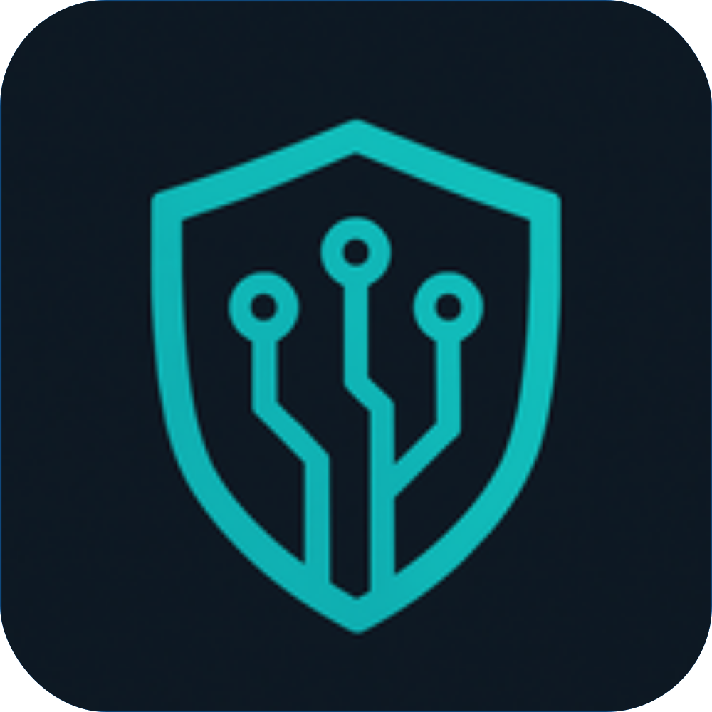
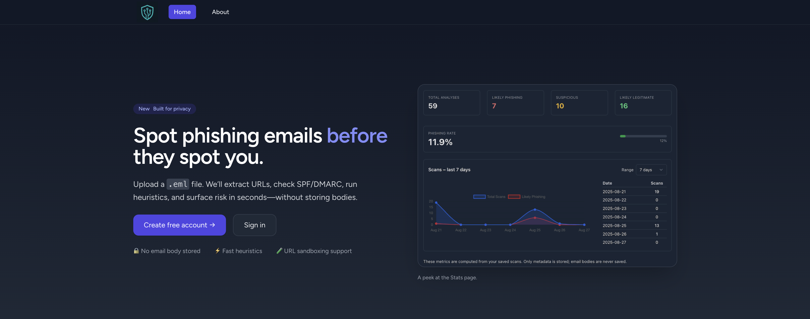

<p align="center">
  
</p>
<h1 align="center">CyberToolsHub</h1>
<p align="center"><em>Pré TPI 2025 — A modern cybersecurity tools hub built with Laravel</em></p>

<p align="center">
  <a href="https://github.com/FS08/PreTPI-CyberToolsHub/actions"></a>
  
  
  
  
  
</p>

<p align="center">
  A modern <strong>cybersecurity tools hub</strong> built with Laravel, Tailwind CSS, and Alpine.js.<br/>
  This project is part of my <strong>Pré TPI 2025</strong> and aims to centralize, experiment with, and showcase tools that bridge <strong>web development</strong> and <strong>security operations</strong>.
</p>

---

## 📸 Screenshot

Here’s a preview of the application:

<p align="center">
  
</p>

---

## 📖 Table of Contents
- [📸 Screenshot](#-screenshot)
- [📖 Table of Contents](#-table-of-contents)
- [✨ Features](#-features)
- [🛠️ Tech Stack](#️-tech-stack)
- [📂 Project Structure](#-project-structure)
- [⚡ Quick Start](#-quick-start)
  - [Prerequisites](#prerequisites)
  - [Installation](#installation)
  - [Run Locally](#run-locally)
  - [Build for Production](#build-for-production)
- [⚙️ Configuration](#️-configuration)
- [🧪 Testing](#-testing)
- [🤝 Contributing](#-contributing)
- [📜 License](#-license)
- [👤 Author](#-author)

---

## ✨ Features

- Built on **Laravel** for a solid backend foundation  
- **Blade + Tailwind CSS** for clean, responsive, and modern UI  
- **Alpine.js** for interactive components without heavy frameworks  
- **Axios** for smooth async requests and API integrations  
- **Vite** for fast builds and hot reloading in development  
- Database-ready with **Eloquent ORM**  
- CI/CD with GitHub Actions (see build badge above)  

> 💡 Future Roadmap: Integration of specific **cybersecurity utilities** (e.g., log analyzers, phishing analysis modules, dashboards for SOC use cases).

---

## 🛠️ Tech Stack

**Backend**: PHP 8+, Laravel  
**Frontend**: Blade, TailwindCSS, Alpine.js, Axios  
**Build Tools**: Vite, PostCSS, npm  
**Testing**: PHPUnit, Laravel test suite  
**Package Highlights**:
- `@tailwindcss/forms`  
- `alpinejs`  
- `axios`  
- `laravel-vite-plugin`

---

## 📂 Project Structure
```text
.
├── app/                # Core application code
├── resources/          # Views, components, and frontend assets
├── routes/             # API & web routes
├── database/           # Migrations & seeders
├── tests/              # PHPUnit & Laravel tests
├── public/             # Publicly accessible files
├── config/             # Laravel configuration files
├── .env.example        # Example environment config
└── ...
```

---

## ⚡ Quick Start

### Prerequisites
- PHP >= 8.0  
- Composer  
- Node.js + npm  

### Installation
```bash
# Clone the repo
git clone https://github.com/FS08/PreTPI-CyberToolsHub.git
cd PreTPI-CyberToolsHub

# Install dependencies
composer install
npm install

# Set up environment
cp .env.example .env
php artisan key:generate
# This command generates a unique APP_KEY used by Laravel to secure sessions and encrypted data.
# It must be set before the application can run properly.

# Configure DB in .env then run:
php artisan migrate --seed
```

### Run Locally
```bash
npm run dev      # Build & watch frontend
php artisan serve  # Start Laravel server (http://localhost:8000)
```

### Build for Production
```bash
npm run build
```

---

## ⚙️ Configuration
Most settings are managed via the `.env` file.  
Key environment variables:
```ini
APP_NAME=CyberToolsHub
APP_ENV=local
APP_KEY=base64:...
DB_CONNECTION=mysql
DB_HOST=127.0.0.1
DB_PORT=3306
DB_DATABASE=cybertoolshub
DB_USERNAME=root
DB_PASSWORD=
```

🔑 **Note on APP_KEY**:  
The `APP_KEY` is a secret key generated by Laravel and stored in `.env`.  
It is critical for encrypting cookies, sessions, and other sensitive data.  
Always generate it with `php artisan key:generate` and never share it publicly.

---

## 🧪 Testing
Run the test suite with:
```bash
php artisan test
# or
vendor/bin/phpunit
```

GitHub Actions automatically runs tests on each push/PR to `main`.

---

## 🤝 Contributing
Pull requests and discussions are welcome!  
- Fork the repo  
- Create your feature branch (`git checkout -b feature/AmazingFeature`)  
- Commit changes (`git commit -m 'Add some AmazingFeature'`)  
- Push to the branch (`git push origin feature/AmazingFeature`)  
- Open a Pull Request  

---

## 📜 License
This project is licensed under a **Custom Non-Commercial License**.  
See the [LICENSE](LICENSE) file for details.

---

## 👤 Author
**Fábio Santos**  
📧 pro.fabiosantos08@gmail.com  
🔗 [GitHub Profile](https://github.com/FS08)

---

🔥 *CyberToolsHub is more than just a school project — it’s a personal sandbox for exploring how modern web technologies can empower cybersecurity workflows.*  
